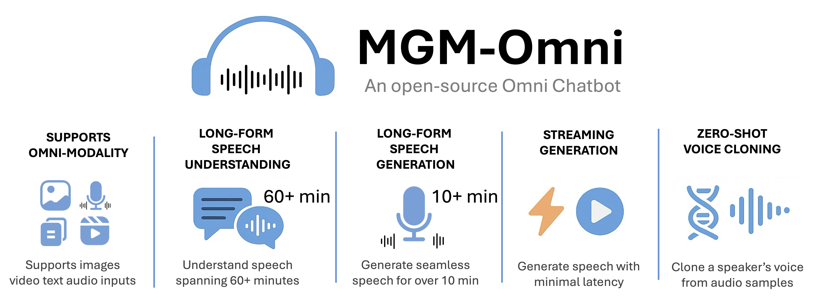

<div align=center>

</div>

<div align="center">

# MGM-Omni: Scaling Omni LLMs to Personalized Long-Horizon Speech</span>

[](https://arxiv.org/abs/2509.25131)
[](https://mgm-omni.notion.site/MGM-Omni-An-Open-source-Omni-Chatbot-2395728e0b0180149ac9f24683fc9907?source=copy_link)
[](https://huggingface.co/papers/2509.25131)
[](https://huggingface.co/collections/wcy1122/mgm-omni-6896075e97317a88825032e1)
[](https://huggingface.co/datasets/wcy1122/Long-TTS-Eval)
[](https://huggingface.co/spaces/wcy1122/MGM-Omni)

</div>


We present MGM-Omni, an omni-chatbot capable of processing text, image, video, and speech inputs, and can generate both text and speech responses. Based on MiniGemini and MiniGemini v2 (Lyra), MiniGemini-Omni (MGM-Omni) enables long-form speech understanding and generation, as well as voice cloning in both Chinese and English.

#### Related Projects
- [Mini-Gemini: Mining the Potential of Multi-modality Vision Language Models](https://github.com/dvlab-research/MGM)
- [Lyra: An Efficient and Speech-Centric Framework for Omni-Cognition](https://github.com/dvlab-research/Lyra)

## Main Properties
1. **Omni-modality supports**: MGM-Omni supports audio, video, image, and text inputs, understands long contexts, and can generate both text and speech outputs, making it a truly versatile multi-modal AI assistant.
2. **Long-form Speech Understanding**: Unlike most existing open-source multi-modal models, which typically fail with inputs longer than 15 minutes, MGM-Omni can handle hour-long speech inputs while delivering superior overall and detailed understanding and performance!
3. **Long-form Speech Generation**: With a treasure trove of training data and smart Chunk-Based Decoding, MGM-Omni can generate over 10 minutes of smooth, natural speech for continuous storytelling.
4. **Streaming Generation**: Thanks to the parallel decoding approach for speech tokens, MGM-Omni enables efficient and smooth streaming audio, making it suitable for live conversations.
5. **Zero-shot Voice Cloning**: With MGM-Omni’s extensive and diverse audio training, you can create a customized voice clone by simply recording a short clip (around 10 seconds) and reviewing the results.
6. **Fully Open-source**: All the code, models, and training data will be released.


## News
- [9/30] 🔥 The [technical report](https://arxiv.org/abs/2509.25131) for MGM-Omni is available at arxiv.
- [9/29] 🔥 We release [Long-TTS-Eval](https://huggingface.co/datasets/wcy1122/Long-TTS-Eval), a benchmark for evaluating long-form and complex TTS. Please refer [here](https://github.com/dvlab-research/MGM-Omni/blob/main/mgm/eval/long_tts_eval/long_tts_eval.md) for more evaluation detail.
- [9/27] 🔥 We release [MGM-Omni-TTS-2B-0927](https://huggingface.co/wcy1122/MGM-Omni-TTS-2B-0927), a stronger SpeechLM with more robust speech output.
- [8/18] 🔥 MGM-Omni is coming! We release the [blog post](https://mgm-omni.notion.site/MGM-Omni-An-Open-source-Omni-Chatbot-2395728e0b0180149ac9f24683fc9907?source=copy_link), [demo](https://huggingface.co/spaces/wcy1122/MGM-Omni), [model](https://huggingface.co/collections/wcy1122/mgm-omni-6896075e97317a88825032e1) and [code](https://github.com/dvlab-research/MGM-Omni). More code and data will be released later!


## TODO
- [x] Arxiv preprint
- [x] Long TTS benchmark
- [ ] Training and Fine-tuning code
- [ ] Training data


## Install
Please follow the instructions below to install the required packages.

1. Clone this repository:
```bash
git clone https://github.com/dvlab-research/MGM-Omni.git
```

2. Install Package:
```bash
conda create -n mgm-omni python=3.10 -y
conda activate mgm-omni
cd MGM-Omni
git submodule update --init --recursive
pip install --upgrade pip
pip install -e .
```


## Usage

### Zero-Shot Voice Cloning

Generate audio that sounds similar as the provided reference audio.

```bash
python -m mgm.serve.cli_tts \
--model wcy1122/MGM-Omni-TTS-2B-0927 \
--ref-audio assets/ref_audio/Man_EN.wav
```

Add `--ref-audio-text` for a more accurate reference audio transcript. Otherwise, Whisper-large-v3 will be used for automatic transcription.


### Chat as an Omni chatbot

**Chat with Text Input**

```bash
python -m mgm.serve.cli \
--model wcy1122/MGM-Omni-7B \
--speechlm wcy1122/MGM-Omni-TTS-2B-0927
```

Add `--ref-audio` and `--ref-audio-text` (optional) if you want MGM-Omni to response with a specific voice.

**Chat with Visual Input**

```bash
python -m mgm.serve.cli \
--model wcy1122/MGM-Omni-7B \
--speechlm wcy1122/MGM-Omni-TTS-2B-0927 \
--image-file assets/examples/ronaldo.jpg
```

To explore more modality, use `--video-file` for video input and `--audio-file` for audio input.

**Chat with Multi Modality Input**

```bash
python -m mgm.serve.cli \
--model wcy1122/MGM-Omni-7B \
--speechlm wcy1122/MGM-Omni-TTS-2B-0927 \
--image-file assets/examples/ronaldo.jpg \
--audio-file assets/examples/instruct.wav
```

For Multi Modality input, use `--image-file`, `--video-file` and `--audio-file` for each modality.

### Lunch Local Gradio Demo

```bash
python -m mgm.serve.web_demo \
--model wcy1122/MGM-Omni-7B \
--speechlm wcy1122/MGM-Omni-TTS-2B-0927
```

Use this command to lunch a gradio demo locally.

### Long-TTS-Eval Benchmark
Please refer [here](https://github.com/dvlab-research/MGM-Omni/blob/main/mgm/eval/long_tts_eval/long_tts_eval.md) for the output format and evaluation script of **Long-TTS-Eval**.

## Architecture

<div align=center>

</div>

MGM-Omni is an advanced omni model designed to handle text, image, video, and speech inputs, with the ability to generate both text and speech. For inputs from different modalities, we employ modality-specific encoders to extract features, which are subsequently fed into the MLLM. The text generated by the MLLM is then passed to SpeechLM, which produces speech tokens using a Chunk-Based Parallel Decoding strategy. These speech tokens are further transformed into Mel-Spectrograms via a Flow Matching model, and the final audio is synthesized using a vocoder.
Please refer to our [blog post](https://mgm-omni.notion.site/MGM-Omni-An-Open-source-Omni-Chatbot-2395728e0b0180149ac9f24683fc9907?source=copy_link) for more technical detail.


## Evaluation

### Speech and Audio Understanding

| Model            | Date    | LS-clean↓ | LS-other↓ | CM-EN↓  | CM-ZH↓  | AISHELL↓ |
|:-----------------|:--------|:----------|:----------|:--------|:--------|:---------|
| Mini-Omni2       | 2024-11 | 4.7       | 9.4       | -       | -       | -        |
| Lyra             | 2024-12 | 2.0       | 4.0       | -       | -       | -        |
| VITA-1.5         | 2025-01 | 3.4       | 7.5       | -       | -       | 2.2      |
| Qwen2.5-Omni     | 2025-03 | 1.6       | 3.5       | **7.6** | 5.2     | -        |
| Ola              | 2025-06 | 1.9       | 4.3       | -       | -       | -        |
| **MGM-Omni-7B**  | 2025-08 | 1.7       | 3.6       | 8.8     | 4.5     | 1.9      |
| **MGM-Omni-32B** | 2025-08 | **1.5**   | **3.2**   | 8.0     | **4.0** | **1.8**  |

This table presents WER and CER results on speech understanding.
Here LS refers to LibriSpeech and CM refers to Common Voice.

| Model            | Date    | Speech↑ | Sound↑  | Music↑  | Mix↑    | Average↑ |
|:-----------------|:--------|:--------|:--------|:--------|:--------|:---------|
| LLaMA-Omni       | 2024-08 | 5.2     | 5.3     | 4.3     | 4.0     | 4.7      |
| Mini-Omni2       | 2024-11 | 3.6     | 3.5     | 2.6     | 3.1     | 3.2      |
| IXC2.5-OmniLive  | 2024-12 | 1.6     | 1.8     | 1.7     | 1.6     | 1.7      |
| VITA-1.5         | 2025-01 | 4.8     | 5.5     | 4.9     | 2.9     | 4.5      |
| Qwen2.5-Omni     | 2025-03 | 6.8     | 5.7     | 4.8     | 5.4     | 5.7      |
| Ola              | 2025-06 | **7.3** | 6.4     | 5.9     | 6.0     | 6.4      |
| **MGM-Omni-7B**  | 2025-08 | **7.3** | **6.5** | **6.3** | 6.1     | **6.5**  |
| **MGM-Omni-32B** | 2025-08 | 7.1     | **6.5** | 6.2     | **6.2** | **6.5**  |

This table presents evaluation results on AIR-Bench Chat (speech, sound, music, etc.).

### Speech Generation

| Model           | Date    | Model Size | CER↓     | SS(ZH)↑   | WER↓     | SS(EN)↑   |
|:----------------|:--------|:-----------|:---------|:----------|:---------|:----------|
| CosyVoice2      | 2024-12 | 0.5B       | 1.45     | 0.748     | 2.57     | 0.652     |
| Qwen2.5-Omni-3B | 2025-03 | 0.5B       | 1.58     | 0.744     | 2.51     | 0.635     |
| Qwen2.5-Omni-7B | 2025-03 | 2B         | 1.42     | 0.754     | 2.33     | 0.641     |
| MOSS-TTSD-v0    | 2025-06 | 2B         | 2.18     | 0.594     | 2.46     | 0.476     |
| HiggsAudio-v2   | 2025-07 | 6B         | 1.66     | 0.743     | 2.44     | 0.677     |
| **MGM-Omni**    | 2025-08 | 0.6B       | 1.42     | 0.750     | 2.48     | 0.670     |
| **MGM-Omni**    | 2025-08 | 2B         | 1.28     | 0.755     | 2.28     | 0.684     |
| **MGM-Omni**    | 2025-08 | 4B         | **1.18** | **0.758** | **2.22** | **0.686** |

This table presents evaluation results on speech generation on seed-tts-eval.
For Qwen2.5-Omni, model size refers to the size of the talker.

| Model             | Date    | Model Size | EN WER↓  | ZH CER↓  | EN-hard WER↓ | ZH-hard WER↓ |
|:------------------|:--------|:-----------|:---------|:---------|:-------------|:-------------|
| CosyVoice2(chunk) | 2024-12 | 0.5B       | 14.80    | **5.27** | 42.48        | 32.76        |
| MOSS-TTSD-v0.5    | 2025-06 | 6B         | 8.69     | 6.82     | 62.61        | 62.97        |
| HiggsAudio-v2     | 2025-07 | 6B         | 27.09    | 31.39    | 98.61        | 98.85        |
| **MGM-Omni**      | 2025-08 | 2B         | **4.98** | 5.58     | **26.26**    | **23.58**    |

This table presents evaluation results on long-form and hard speech generation on long-tts-eval.

### Demo
We provide some examples in our [blog post](https://mgm-omni.notion.site/MGM-Omni-An-Open-source-Omni-Chatbot-2395728e0b0180149ac9f24683fc9907?source=copy_link). If you want to explore more, welcome to try our [web demo](https://huggingface.co/spaces/wcy1122/MGM-Omni)!


## Citation
If you find this repo useful for your research, we would appreciate it if you could cite our work 😊:
```
@article{wang2025mgm,
  title={MGM-Omni: Scaling Omni LLMs to Personalized Long-Horizon Speech},
  author={Wang, Chengyao and Zhong, Zhisheng and Peng, Bohao and Yang, Senqiao and Liu, Yuqi and Gui, Haokun and Xia, Bin and Li, Jingyao and Yu, Bei and Jia, Jiaya},
  journal={arXiv preprint arXiv:2509.25131},
  year={2025}
}

@inproceedings{zhong2025lyra,
  title={Lyra: An Efficient and Speech-Centric Framework for Omni-Cognition},
  author={Zhong, Zhingsheng and Wang, Chengyao and Liu, Yuqi and Yang, Senqiao and Tang, Longxiang and Zhang, Yuechen and Li, Jingyao and Qu, Tianyuan and Li, Yanwei and Chen, Yukang and Yu, Shaozuo and Wu, Sitong and Lo, Eric and Liu, Shu and Jia, Jiaya},
  booktitle={Proceedings of the IEEE/CVF international conference on computer vision},
  year={2025}
}

@article{li2024mgm,
  title={Mini-Gemini: Mining the Potential of Multi-modality Vision Language Models},
  author={Li, Yanwei and Zhang, Yuechen and Wang, Chengyao and Zhong, Zhisheng and Chen, Yixin and Chu, Ruihang and Liu, Shaoteng and Jia, Jiaya},
  journal={arXiv:2403.18814},
  year={2024}
}
```

## Acknowledgement
We would like to thank the following repos for their great work:

- This work is built upon the [LLaVA Series](https://github.com/LLaVA-VL/LLaVA-NeXT), [Mini-Gemini](https://github.com/dvlab-research/MGM) and [Lyra](https://github.com/dvlab-research/Lyra).
- This work use VLMs and Vision Encoder from [Qwen2.5-VL](https://huggingface.co/Qwen/Qwen2-VL-7B-Instruct).
- This work use LLMs from [Qwen3 Series](https://huggingface.co/collections/Qwen/qwen3-67dd247413f0e2e4f653967f).
- This work use Audio Tokenizer and Flow Matching model from [CosyVoice2](https://github.com/FunAudioLLM/CosyVoice).
- This work use Audio Encoder from [Belle-whisper](https://huggingface.co/BELLE-2/Belle-whisper-large-v3-zh) and [Qwen2-Audio](https://github.com/QwenLM/Qwen2-Audio).
- This work use [MegaTTS](https://github.com/bytedance/MegaTTS3) to generate a large amounts of synthetic data.
